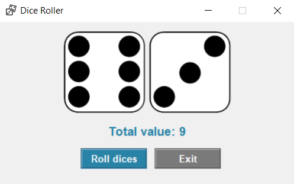

### Dice Roller
Simple Python application built with Tkinter which allows user to roll two six-sided dices. It's a fun and easy way to simulate rolling dice for board games, tabletop role-playing games, or any other activities that involve random number generation.
<div style="text-align: center"></div>
<div style="text-align: center; font-size: small"><i>Screenshot</i></div>

### Setup
1. Clone this repository or download ZIP file:
```
git clone https://github.com/emilian-klein/dice-roller.git
```
2. Go to project directory.
3. Install dependencies:
```
pip install -r requirements.txt
```
4. Run the application:
```
python dice_roller.py
```